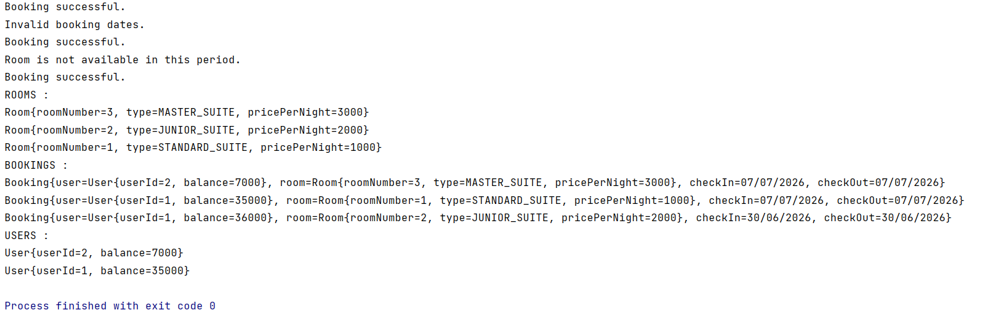

# skp-test2

### Design Questions (Bonus)

###### 1/- Suppose we put all the functions inside the same service. Is this the recommended approach ? Please explain.

No, putting all the functions inside a single Service class is not the recommended approach in most real-world applications.

This pattern violates the principle of Separation of Concerns (SoC). A better design would separate responsibilities into focused classes:

- **UserService**: Manages user creation, balance updates, and user-related queries.
- **RoomService**: Manages room creation, updates, and room availability checks.
- **BookingService**: Handles booking logic, availability verification, and booking records.

Why avoid a monolithic service?
1. **Maintainability**: Smaller, focused classes are easier to read, test, and debug.
2. **Scalability**: You can independently evolve or scale parts of the system.
3. **Testability**: Unit tests can be written in isolation for each service.
4. **Collaboration**: Easier for multiple developers to work on different parts without conflicts.
5. **Reusability**: Modular services can be reused across different applications or APIs.

###### 2/- In this design, we chose to have a function setRoom(..) that should not impact the previous bookings. What is another way ? What is your recommendation ? Please explain and justify.

An alternative to protecting old bookings from changes in the room definition is to allow mutable room definitions (e.g., updating the price or type),
but capture the room's state inside each Booking at the time of booking.

This design is called **data snapshotting**, and it's already partially implemented in our Booking class, which copies room details during booking creation.

Alternative Approach:
- Allow `setRoom(...)` to update the room's attributes (like price or type).
- In the `Booking` object, store a snapshot (copy) of the room's data at the moment of booking.
- This ensures that historical bookings reflect what the room looked like when the booking was made, regardless of later modifications.

Advantages:
1. **More Flexible**: You can update room prices, types, etc., for future bookings.
2. **Historical Accuracy**: Old bookings remain consistent with their original state.
3. **Avoids Data Loss**: You don’t lose the evolution of the room over time.
